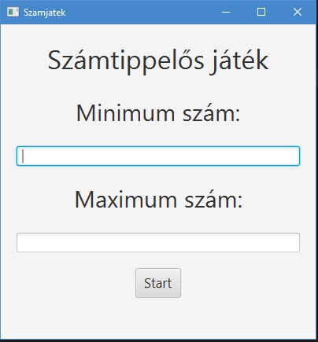
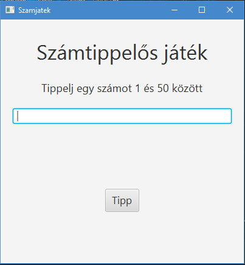

# Funkcionális specifikáció
## 1. Áttekintés

Egy vidéki kisvárosi általáos iskola napközis csoportok oktató találták ki, hogy jó lenne játékosan tanítani az első osztályosokat a számok megismerésére ezért felkértek minket egy egyszerű számkitalálós játék lefejlesztésére.
Egy olyan mini játék alkalmazást fejlesztettüknk ki amely legenerál egy random számot 1 és 100 között vagy a felhasználónak kell megadnia egy minimum és maximum számot és ezt kell kitalálnia. 
A játékban segítséget kap a játékos, hogy a keresett szám az kissebb vagy nagyobb.

## 2. Jelenlegi helyzet
A meglévő alap játékot szeretnénk kiegészíteni olyan funkciókkal, hogy a játékos saját maga tudja beállítani az alsó és felső határokat. 
Ezen felül hibakezelési módszereket kell még beépíteni a kódba, hogy a felhasználó ne tudjon megadni rossz adatokat.  

## 3. Jelenlegi üzleti folyamatok modellje
Egyszerű játék, ha nagy korlátokat állítasz be akkor, hogy a leggyorsabban megtalálja a játékos a keresett számot vagy szerencsésnek vagy logikusan kell gondolkoznia.

## 4. Követelménylista
***
| ID         | Verzio  | Követelmény |  Funkció|
|:-------------:| ---- |:----------|--------|
| K1 | 1.1 | A felhasználó kitudja választani a játékmódot| A főmenüben a felhasználó 2 gomb segítségével kitudja választani az adott játékmódot |
| K2 | 1.0 | A felhasználó fel tudja venni a min és max határt | A haladó játékmódban 2 box megadása amiben a játékosok megtudják adni a min és maximum értéket|
| K3 | 1.0 |  A rendszer kiírja helyesen, hogy alacsonyabb vagy magasabb a keresett szám | játék közben egy szöveg ugrik fel segítség gyaránt, hogy kissebb vagy nagyobb a keresett szám|
| K4 | 1.0 |A felhasználó újratudja indítani a játékot a neki kedvező paraméterekkel | Reset gomb megjelenítése a jéték végén.|

## 5. Képernyőterv
 Kezdő ablak: 

 Játék ablak: 

## 6. Forgatókönyv
Futási időben kettő szereplő figyelhető meg.
Az egyik maga az alkalmazás, ami várja az input-ot, ami alapján a játék paraméterei beállíthatóak.
A másik szereplő a felhasználó, aki az ablakon elkhelyezett elemeket feltduja tölteni a kedve szerint.
Nem megfelelő adatok esetén a játék szól, a helytelenségről.

## 7. Fogalomszótár
input - Bemenet, amit az alkalmazás vár a felhasználótól  

felhasználók - Azok a személyek, akiknek létre lett hozva egy alkalmazás és ők használják azt.
